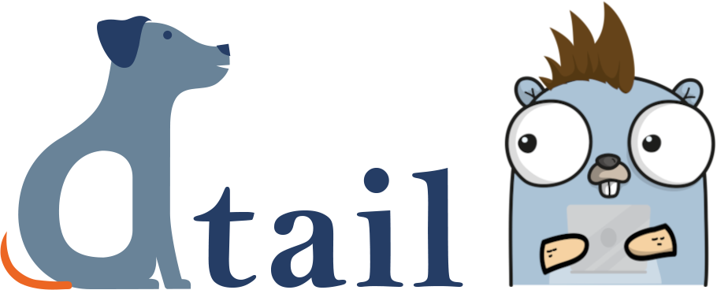

DTail
=====



[](https://www.apache.org/licenses/LICENSE-2.0.html) [](https://goreportcard.com/report/github.com/mimecast/dtail) [](https://www.vbrandl.net/post/2019-05-03_hits-of-code/)   

DTail (a distributed tail program) is a DevOps tool for engineers programmed in Google Go for following (tailing), catting and grepping (including gzip and zstd decompression support) log files on many machines concurrently. An advanced feature of DTail is to execute distributed MapReduce aggregations across many devices.

For secure authorization and transport encryption, the SSH protocol is used. Furthermore, DTail respects the UNIX file system permission model (traditional on all Linux/UNIX variants and also ACLs on Linux based operating systems).

The DTail binary operates in either client or server mode. The DTail server must be installed on all server boxes involved. The DTail client (possibly running on a regular Laptop) is used interactively to connect to the servers concurrently. That currently scales to multiple thousands of servers per client. Furthermore, DTail can be operated in a serverless mode too. Read more about it in the documentation.


If you like what you see [look here for more examples](doc/examples.md)! You can also read through the [DTail Mimecast Engineering Blog Post](https://medium.com/mimecast-engineering/dtail-the-distributed-log-tail-program-79b8087904bb).

Installation and Usage
======================

* Check out the [DTail Documentation](doc/index.md)

Interactive Query Reload
========================

`dtail`, `dgrep`, `dcat`, and `dmap` accept `--interactive-query` to keep the
current run open and listen for control commands on the controlling TTY.

Available control commands:

* `:reload <flags>` apply a new workload without restarting the client
* `:show` print the current interactive state, including capability counts
* `:help` print the interactive command help text
* `:quit` stop the interactive session

Reload flags are mode-specific:

* `dtail` and `dgrep`: `--grep`/`--regex`, `--before`, `--after`, `--max`,
  `--invert`, plus shared flags such as `--files`, `--plain`, `--quiet`, and
  `--timeout`
* `dmap`, and query-driven `dtail`: `--query` plus the shared flags above
* `dcat`: shared flags such as `--files`, `--plain`, `--quiet`, and `--timeout`

Examples:

```bash
dtail --servers app01 --files /var/log/app.log --grep ERROR --interactive-query
# then type:
:reload --grep WARN

dgrep --servers app01 --files /var/log/app.log --grep ERROR --interactive-query
# then type:
:reload --grep WARN --before 2 --after 3

dmap --servers app01 --files /var/log/app.log \
  --query 'from STATS select count($line) group by hostname' \
  --interactive-query
# then type:
:reload --query "from STATS select count($line),avg(latency) group by hostname"
```

Compatibility and session reuse:

* On startup, an interactive client first tries `SESSION START` when the remote
  side advertises the `query-update-v1` capability
* If a server is older or does not advertise that capability, startup falls
  back to the legacy command stream automatically, so mixed-version
  client/server combinations still run the original workload normally
* Live `:reload` updates require every active server to advertise
  `query-update-v1`; otherwise the reload is rejected and the current workload
  keeps running unchanged
* On capable servers, DTail reuses the existing SSH session and sends
  `SESSION UPDATE` messages instead of reconnecting
* Every successful reload advances a generation boundary; late output from the
  previous workload is dropped so stale matches do not leak into the new result
  stream

Auth-Key Fast Reconnect
=======================

DTail supports an optional SSH auth optimization for repeated reconnects.
After a normal authenticated SSH session is established, the client can
register a local public key with `dserver` using an `AUTHKEY` command. The
server stores this key in memory only and checks it before `authorized_keys`
on subsequent connections.

This reduces repeated hardware-token signing (for example YubiKey-backed SSH
agent keys) while keeping transparent fallback to normal SSH authentication.

Client options:

* `--auth-key-path` path to the private key to offer first and register
  (default: `~/.ssh/id_rsa`)
* `--no-auth-key` disable auth-key registration/fast-path and use normal SSH
  behavior only

Server configuration (`dtail.json`):

```json
{
  "Server": {
    "AuthKeyEnabled": true,
    "AuthKeyTTLSeconds": 86400,
    "AuthKeyMaxPerUser": 5
  }
}
```

Security notes:

* Registered keys are stored in memory only (no disk persistence)
* Registration is accepted only over an already-authenticated session
* TTL expiry and per-user key limits bound key lifetime and memory growth
* If fast-path auth is unavailable (restart/expiry/mismatch), DTail falls back
  to normal SSH auth automatically

More
====

* [How to contribute](CONTRIBUTING.md)
* [Code of conduct](CODE_OF_CONDUCT.md)
* [Licenses](doc/licenses.md)

Credits
=======

* DTail was created by **Paul Buetow** *<pbuetow@mimecast.com>*
* Thank you [Mimecast](https://www.mimecast.com) for supporting this Open-Source project.
* Thank you to **Vlad-Marian Marian** for creating the DTail (dog) logo.
* The Gopher was generated at https://gopherize.me
